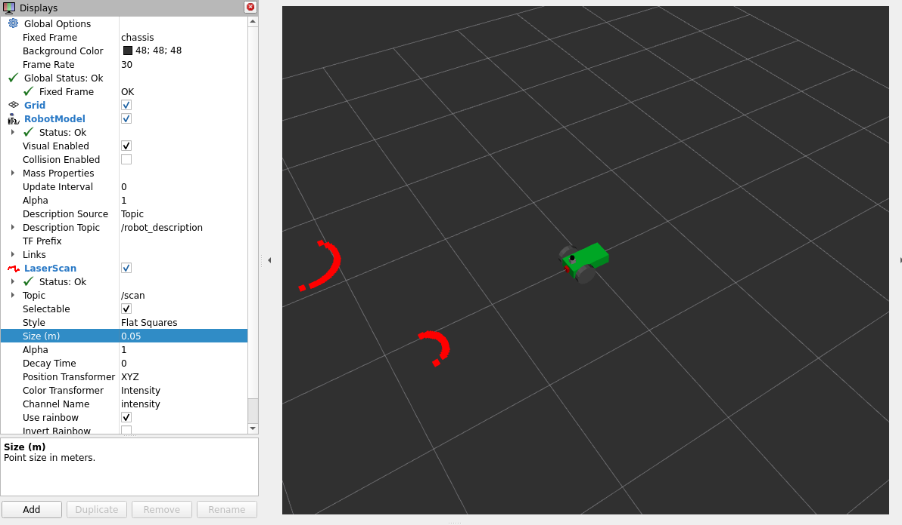

# Differential drive controller robot with two sensors.
In this tutorial we will build a differential drive controller robot using xacro properties. We will add two sensors, a camera, lidar and finally we control the robot model by adding differential drive plugin. 

Totally, you will learn the following:
- how to add lidar to robot and adding a new mesh file.
- how to add a camera to robot.
- how to add differential drive control to the robot.
- Create a simple algorithm for obsackle avoidance.

You can find a presentation that will guide you through this tutorial. In the presentation, you can find information on how to build this robot.
- [Create a differential drive controller robot](https://docs.google.com/presentation/d/1JCBwxNok0eC-tr-dRsIzfJUy-XPxEjk6/edit?usp=drive_web&ouid=106628092038381749227&rtpof=true) Greek language.
- Create a differential drive controller robot. English language (comming soon).

You can find a project in the following link:
- [Project]() Greek language.
- [Project]() English language( Coming soon).

## Create, build and setup a new package.
Create a new ROS 2 package for the differential drive control robot
```
cd ~/ros2_ws/src
ros2 pkg create --build-type ament-python my_robot
```

Create some folders to the package for better organization.
```
cd ~/ros2_ws/src
mkdir launch urdf meshes worlds
```

After creating the package and the folders, you need to modify the setup.py file of the package.
Add the following modules.
```py
from glob import glob
import os
```
In the data_files list of the script add the following.
```py
        (os.path.join('share',package_name,'launch'),
         glob(os.path.join('launch','*.launch.py'))),
        (os.path.join('share',package_name,'urdf'),
         glob(os.path.join('urdf','*.xacro'))),
         (os.path.join('share',package_name,'urdf'),
         glob(os.path.join('urdf','*.gazebo'))),
        (os.path.join('share',package_name,'worlds'),
         glob(os.path.join('worlds','*.world'))),
        (os.path.join('share',package_name,'meshes'),
         glob(os.path.join('meshes','*.dae'))),
```

The next step is building the package using the colcon tool.
```
cd ~/ros2_ws/
colcon build --packages-select my_robot
```

## Two wheel robot with camera, lidar and differential drive controller.
First of all we need to create the robot model. We will create two files which is the following
 - Create [myrobot.xacro](https://github.com/DimitrisKatos/my_robot/blob/master/urdf/myrobot.xacro) in the urdf folder of the package. This file is the two-wheeled robot.
 - Create [robot.gazebo](https://github.com/DimitrisKatos/my_robot/blob/master/urdf/robot.gazebo) in the urdf folder of the package. In this file we define all the Gazebo plugins. So far, we define colors for every link and attrition. 

Now the robot is ready. Let's move to some more interest staff. 

---
## Add a camera to robotmodel.
Now we will add a camera to robot model. For this reason we need to add a new link and joint to the robot model. Furthermore you need to add a new Gazebo plugin to the robot.gazebo file. 
- In the [myrobot.xacro](https://github.com/DimitrisKatos/my_robot/blob/master/urdf/myrobot.xacro) file we add a box link in front of the robot model.
- In the robot.gazebo file we add the following xml code to enable the camera in the gazebo simulator.
```xml
<!-- camera -->
  <gazebo reference="camera">
    <sensor type="camera" name="camera1">
      <update_rate>30.0</update_rate>
      <camera name="head">
        <horizontal_fov>1.3962634</horizontal_fov>
        <image>
          <width>800</width>
          <height>800</height>
          <format>R8G8B8</format>
        </image>
        <clip>
          <near>0.02</near>
          <far>300</far>
        </clip>
      </camera>
      <plugin name="camera_controller" filename="libgazebo_ros_camera.so">
        <alwaysOn>true</alwaysOn>
        <updateRate>0.0</updateRate>
        <cameraName>my_robot/camera1</cameraName>
        <imageTopicName>image_raw</imageTopicName>
        <cameraInfoTopicName>camera_info</cameraInfoTopicName>
        <frameName>camera_link</frameName>
        <hackBaseline>0.07</hackBaseline>
        <distortionK1>0.0</distortionK1>
        <distortionK2>0.0</distortionK2>
        <distortionK3>0.0</distortionK3>
        <distortionT1>0.0</distortionT1>
        <distortionT2>0.0</distortionT2>
      </plugin>
    </sensor>
  </gazebo>  
```

Now we can use the Gazebo Classic Simulator to see if the camera works properly. Also we will visualize the results from the camera to RVIZ. Now let's visualize the robot to Gazebo. Run the next commands.
```
cd ~/ros2_ws
colcon build --package-select my_robot
cd src/my_robot # For WSL run the next command
export LIBGL_ALWAYS_SOFTWARE=1 LIBGL_ALWAYS_INDIRECT=0
ros2 launch my_robot my_robot_gazebo.launch.py
```


After the robot spawn in gazebo we add to obstacles. Now let's visualize the data from the hokuyo laser to RVIZ 2. In a new terminal begin Rviz and you need to make some changes:
- Add RobotModel and change the topic to /robot_descriptiion.
- Add Camera from displays panel and change the topic.
- Finally, change the Fixed Frame to base_link from the displays panel.

In the left bottom you can see what the camera's robot are watching.


## Add lidar to robot model.

First of all, you need to add an new link and joint to robot model. The new link defines the lidar to your robot. Furthermore this link reads a mesh file and visualize a real lidar. In the meshes folder you need to save the [hokuyo.dae file](https://github.com/DimitrisKatos/my_robot/blob/master/meshes/hokuyo.dae).
In the robot model add the following. 
```xml
  <joint name="hokuyo_joint" type="fixed">
    <axis xyz="0 1 0" />
    <origin xyz=".15 0 .1" rpy="0 0 0"/>
    <parent link="base_link"/>
    <child link="hokuyo"/>
  </joint>
 
  <!-- Hokuyo Laser -->
  <link name="hokuyo">
    <collision>
      <origin xyz="0 0 0" rpy="0 0 0"/>
      <geometry>
    <box size="0.1 0.1 0.1"/>
      </geometry>
    </collision>
    <visual>
      <origin xyz="0 0 0" rpy="0 0 0"/>
      <geometry>
           <mesh filename="file://$(find my_robot)/meshes/hokuyo.dae"/>
      </geometry>
    </visual>
    <inertial>
      <mass value="1e-5" />
      <origin xyz="0 0 0" rpy="0 0 0"/>
      <inertia ixx="1e-6" ixy="0" ixz="0" iyy="1e-6" iyz="0" izz="1e-6" />
    </inertial>
  </link>
```

Also add a new gazebo plugin to robot.gazebo file. The XML code will enable lidar to the Gazebo simulator.
```xml
<!-- hokuyo -->
      <gazebo reference="hokuyo">
        <sensor name="laser" type="ray">
            <pose> 0 0 0 0 0 0 </pose>
            <visualize>true</visualize>
            <update_rate>20</update_rate>
            <ray>
                <scan>
                    <horizontal>
                        <samples>360</samples>
                        <min_angle>-1.57</min_angle>
                        <max_angle>1.57</max_angle>
                    </horizontal>
                </scan>
                <range>
                    <min>0.2</min>
                    <max>12</max>
                </range>
            </ray>
            <plugin name="laser_controller" filename="libgazebo_ros_ray_sensor.so">
                <ros>
                    <argument>~/out:=scan</argument>
                </ros>
                <output_type>sensor_msgs/LaserScan</output_type>
                <frame_name>hokuyo</frame_name>
            </plugin>
        </sensor>
    </gazebo>
```
Now let's visualize the robot to Gazebo. Run the next commands.
```
cd ~/ros2_ws
colcon build --package-select my_robot
cd src/my_robot # For WSL run the next command
export LIBGL_ALWAYS_SOFTWARE=1 LIBGL_ALWAYS_INDIRECT=0
ros2 launch my_robot my_robot_gazebo.launch.py
```


Now let's visualize the data from the hokuyo laser to RVIZ 2. In a new terminal begin Rviz and you need to make some changes:
- Add RobotModel and change the topic to /robot_descriptiion.
- Add /laser_scan from displays panel and change the topic.
- Finally, change the Fixed Frame to base_link from the displays panel.

You will see that the obstacles have been detected by hokuyo lidar.


## Differential drive controller and obstacle avoidance algorithm. 

For differential drive control we need to add an extra Gazebo plugin to robot.gazebo file. The XML code you need to add is the following:
```xml
    <!--Differential Drive Controller for 2-wheel-robot-->
     <gazebo>
        <plugin name="diff_drive" filename="libgazebo_ros_diff_drive.so">
            <!-- Wheel Information -->
            <left_joint>left_wheel_hinge</left_joint>
            <right_joint>right_wheel_hinge</right_joint>
            <wheel_separation>0.4</wheel_separation>
            <wheel_diameter>0.1</wheel_diameter>

            <!-- Limits -->
            <max_wheel_torque>200</max_wheel_torque>
            <max_wheel_acceleration>10.0</max_wheel_acceleration>
            
            <!-- Output -->
            <odometry_frame>odom</odometry_frame>
            <robot_base_frame>chassis</robot_base_frame>
            <publish_odom>true</publish_odom>
            <publish_odom_tf>true</publish_odom_tf>
            <publish_wheel_tf>true</publish_wheel_tf>
        </plugin>
    </gazebo> 
```

Now the differential drive is enable and we can send messages to the /cmd_vel topic. 
```
ros2 topic pub /cmd_vel geometry_msgs/msg/Twist '{linear:{x: 0.4}, angular:{z: 0.2}}'
```

The following Python Script is a simple Publisher and Subscriber for ROS 2. We subcribe data from the lidar and we publish to /cmd_vel topic. Create a new file name [diff_drive.py](https://github.com/DimitrisKatos/my_robot/blob/master/my_robot/diff_drive.py) to my_robot folder.
```py
import rclpy
from rclpy.node import Node 

from geometry_msgs.msg import Twist
from sensor_msgs.msg import LaserScan

class diff_drive(Node):
    
    def __init__(self):
        super().__init__('obstacle_avoider')
        # Create the publisher, define the type of message, the topic
        # and the frame rate.
        self.__publisher = self.create_publisher(Twist,'cmd_vel',1)

        # Create the subscriber, define the type of message,
        # the topic and the frame rate
        self.subscription = self.create_subscription(
            LaserScan,
            '/scan',
            self.listener_callback,
            10)

    # Create a method for the class. 
    def listener_callback(self,msg):
        # Create a variable and Define the position of the scanner,
        # which will subcribe the distance.
        self.msg = min(msg.ranges[165:179]+msg.ranges[180:195])
        # Print the measurment distance.
        print(f"The measurment distance is {msg}.")

        # Create a variable, and give him the type of Twist()
        command_msg = Twist()

        # Define the speed of the robot to 0.2 m/s in x axis
        command_msg.linear.x = 0.2
        
        if self.msg < 0.5:
            # Define the speed of the robot, if the obstacle is in front.
            command_msg.angular.z = 2.0
            command_msg.linear.x = 0.0
        
        # Publish the speed.
        self.__publisher.publish(command_msg)

def main(args=None):
    rclpy.init(args=args)
    # Create an instance
    avoider = diff_drive()
    # run the instance
    rclpy.spin(avoider)

    # End the programm with Cntr+C
    avoider.destroy_node()
    rclpy.shutdown()

# Call the main function
if __name__=='__main__':
    main()
```

In the setup.py file inform the entry_points dictionary to the following.
```py
entry_points={
        'console_scripts': [
            'diff_drive = my_robot_description.diff_drive:main'
        ],
    },
```

Put your robot to a building and run the next commands. 
```
cd ~/ros2_ws
colcon build --packages-select my_robot
ros2 run my_robot diff_drive
```
You will see your robot moving forward. When he detects an obstacle he tries to turn.